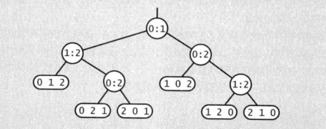
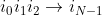

# 归并排序


归并排序（英语：Merge sort，或mergesort），是创建在归并操作上的一种有效的排序算法，效率为O(NlgN)。  
1945年由约翰·冯·诺伊曼首次提出。该算法是采用分治法（Divide and Conquer）的一个非常典型的应用，且各层分治递归可以同时进行。

## 自顶向下的归并排序

递归实现的归并排序是算法设计中分治思想的典型应用。

[include:2-](../../javacode/src/main/java/com/tea/java/algorithm/mergesort/MergeSort1.java)


## 自底向上的归并排序

自底向上的实现是通过迭代实现。

[include:2-](../../javacode/src/main/java/com/tea/java/algorithm/mergesort/MergeSort2.java)


## 排序算法的复杂度

在《算法》[[1]](#References)一书中在归并排序一节谈到一个研究排序算法复杂度的案例。挺值得一说。

命题：没有任何基于比较的算法能够保证使用少于lg(N!)~NlgN次比较将长度为N的数组排序。

证明：
首先，假设没有重复的主键，因为任何排序算法在该情况下讨论才有意义。
我们使用如下二叉树来表示所有比较，假设元素个数为N=3：



树中的节点：
* 一般节点：i:j，表示a[i]和a[j]之间的比较操作。
* 叶子节点：表示元素原顺序的最终排序结果。

我们从来没明确构造这棵树，它只是用来描述算法中比较的一个数学工具。
从这棵比较树我们可以得出结论，
* 这棵树至少有N!个树叶节点。因为N个主键会有N！种排列方式。
* 而从二叉树的性质出发来看，一个高h的二叉树最多可能有2^h个叶子结点。（即完全树的情况）

所以得出结论：
```N! <= 叶子结点数量 <= 2^h``` 

h的值就是最坏情况下的比较次数，因此对不等式的两边取对数即可得到任意算法的比较次数至少是lgN!。
根据斯特宁公式对阶乘函数的近似可得路径（即排序比较次数）为：
```lgN!~NlgN```


## References


[1]Robert Sedgewick,Kevin Wayne.算法（第4版）.中国：人民邮电出版社,2012
[]