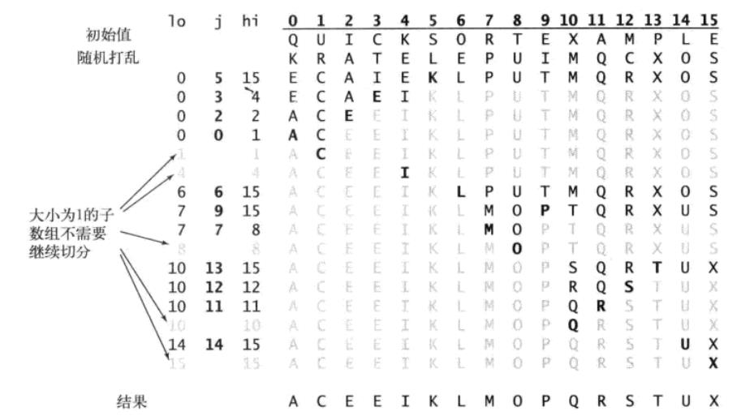

# 快速排序

## 前言

快速排序（Quicksort），又称分区交换排序（partition-exchange sort）。由C. A. R. Hoare大佬在1960年提出。  
在平均状况下，排序`n`个项目要`O(n log n)`次比较。在最坏状况下则需要`O(n^2)次比较，但这种状况并不常见。
事实上，快速排序O(n log n)通常明显比其他算法更快，因为它的内部循环（inner loop）可以在大部分的架构上很有效率地达成。

## 算法介绍

快速排序使用分治法（Divide and conquer）策略来把一个序列（list）分为较小和较大的2个子序列，然后递归地排序两个子序列。

步骤为：
1. 挑选基准值：从数列中挑出一个元素，称为“基准”（pivot），
2. 分割：重新排序数列，所有比基准值小的元素摆放在基准前面，所有比基准值大的元素摆在基准后面（与基准值相等的数可以到任何一边）。在这个分割结束之后，对基准值的排序就已经完成，
3. 递归排序子序列：递归地将小于基准值元素的子序列和大于基准值元素的子序列排序。

快速排序是一种分治的排序算法。它将一个数组分成两个子数组,将两部分独立地排序。
快速排序和归并排序是互补的:归并排序将数组分成两个子数组分别排序,并将有序的子数组归并以将整个 数组排序;而快速排序将数组排序的方式则是当两个子数组都有序时整个数组也就自然有序了。
在第一种情况中,递归调用发生在处理整个数组之前;在第二种情况中,递归调用发生在处理整个数组之后。 
在归并排序中, 一个数组被等分为两半；在快速排序中, 切分(partition) 的位置取决于数组的内容。

该方法的关键在于切分,这个过程使得数组满足下面三个条件: 
* 对于某个j,a[j]已经排定; 
* a[1o]到a[j-1]中的所有元素都不大于a[j]; 
* a[j+1]到a[hi]中的所有元素都不小于a[j]。 
我们就是通过递归地调用切分来排序的。

快排切分的数据移动图：

## 快排实现

简单手写一下快排。

~~~

/**
 *
 * 快速排序算法实现
 *
 * 时间复杂度：O(n log n)  
 * 空间复杂度: O(1)
 *
 * @author teaho2015@gmail.com
 */
public class Quicksort {

    public void sort(Comparable[] a) {
        sort(a, 0, a.length - 1);

    }

    public void sort(Comparable[] a, int lo, int hi) {
        if (hi <= lo) {
            return;
        }
        int j = partition(a, lo, hi);
        sort(a, lo, j-1);
        sort(a, j+1, hi);

    }

    public int partition(Comparable[] a, int lo, int hi) {
        //将数组切分为a[lo...i-1], a[i], a[i+1, hi]进行partition
        int i = lo, j = hi +1;

        Comparable v = a[lo];

        while (true) {
            while (a[++i].compareTo(v) < 0) if (i == hi) break;
            while (a[--j].compareTo(v) > 0) if (j == lo) break;

            if (i >= j) {
                break;
            }
            swap(a, i, j);
        }
        swap(a, lo, j);
        return j;
    }

    private void swap(Comparable[] nums, int index1, int index2) {
        Comparable tmp = nums[index1];
        nums[index1] = nums[index2];
        nums[index2] = tmp;
    }

    public static void main(String[] args) {
        {
            Integer[] arr = new Integer[]{12, 15, 6, 7, 9, 1, 5, 32};
            new Quicksort().sort(arr);
            System.out.println(Arrays.toString(arr));

        }

        {
            Integer[] arr = new Integer[]{1};
            new Quicksort().sort(arr);
            System.out.println(Arrays.toString(arr));

        }
    }

}

~~~

