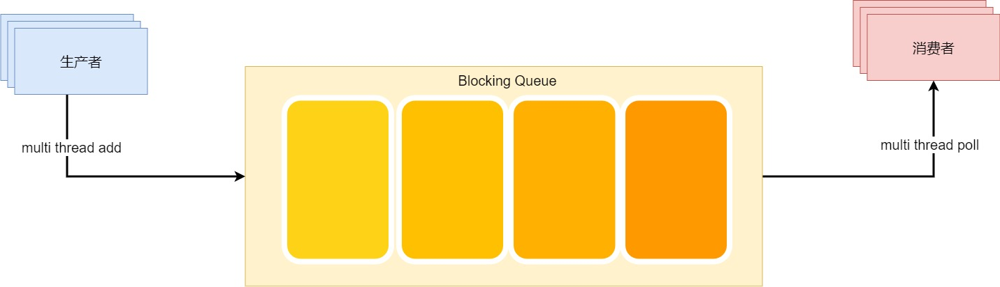

# java.util.concurrent.BlockingQueue接口及其实现类

## 什么是BlockingQueue

阻塞队列(BlockingQueue)就是一个队列额外支持两个附加操作：
1. 支持在检索元素时等待队列变为非空，
2. 在存储元素时等待队列有空余空间。

### 模型

一个一般的队列，都会有消费者和生产者这一场景，而阻塞队列则是适用于在并发场景下，  
在满队列时生产者们进行阻塞等待空间释放。  
在空队列时消费者们进行阻塞等待元素。

## 方法介绍

JAVA doc对BlockingQueue的方法做出如下总结：

<table BORDER CELLPADDING=3 CELLSPACING=1>
<caption>Summary of BlockingQueue methods</caption>
 <tr>
   <td></td>
   <td ALIGN=CENTER><em>抛异常</em></td>
   <td ALIGN=CENTER><em>返回值</em></td>
   <td ALIGN=CENTER><em>阻塞</em></td>
   <td ALIGN=CENTER><em>支持设置超时</em></td>
 </tr>
 <tr>
   <td><b>插入（非空元素）</b></td>
   <td>add(e)</td>
   <td>offer(e) - offer方法是返回操作是否执行成功的boolean</td>
   <td>put(e)</td>
   <td>offer(e, time, unit)}</td>
 </tr>
 <tr>
   <td><b>删除</b></td>
   <td>remove()</td>
   <td>poll()</td>
   <td>take()</td>
   <td>poll(time, unit)</td>
 </tr>
 <tr>
   <td><b>查看（Examine）</b></td>
   <td>element()</td>
   <td>peek()}</td>
   <td><em>无实现</em></td>
   <td><em>无实现</em></td>
 </tr>
</table>

上面说到了核心方法，下面简单说说一些没提到的方法：
~~~~
public interface BlockingQueue<E> extends Queue<E> {
    boolean add(E e);
    boolean offer(E e);
    void put(E e) throws InterruptedException;
    boolean offer(E e, long timeout, TimeUnit unit)
        throws InterruptedException;
    E take() throws InterruptedException;
    E poll(long timeout, TimeUnit unit)
        throws InterruptedException;
    //剩余容量
    int remainingCapacity();
    boolean remove(Object o);
    //是否存在某元素
    public boolean contains(Object o);
    //清空队列，将队列所有元素添加到集合c中，不同于重复调用poll，该方法效率高
    int drainTo(Collection<? super E> c);
    //移除队列中最多maxElements个元素，并添加到集合c中
    int drainTo(Collection<? super E> c, int maxElements);
}
~~~~

## 实现简单分析

BlockingQeque有如下实现类：
    
* BlockingQeque (java.util.concurrent)
    * ArrayBlockingQueue (java.util.concurrent) 数组实现
    * DelayedWorkQueue in ScheduledThreadPoolExecutor (java.util.concurrent) 定时任务线程池里定义的延时工作队列，获取元素时会检测延时时间
    * BlockingDeque (java.util.concurrent) 双向阻塞队列
        * LinkedBlockingDeque (java.util.concurrent) 链表双向阻塞队列
    * SynchronousQueue (java.util.concurrent) 零容量队列，采用cas机制
    * DelayQueue (java.util.concurrent)  延时队列
    * TransferQueue (java.util.concurrent) 
      传递队列接口，核心方法transfer、tryTransfer；  
      TransferQueue 在例如消息传递应用程序中可能很有用，其中生产者有时（使用方法 transfer）阻塞等待消费者调用 take 或 poll 来接收元素，
      而在其他时候将元素（通过方法 put）放入队列而不等待接收。
    * LinkedBlockingQueue (java.util.concurrent) 链表实现
    * PriorityBlockingQueue (java.util.concurrent) PriorityBlockingQueue是一个支持优先级的无界阻塞队列。

源码不在该节分析，
他们的核心方法有不少雷同的地方--都是通过ReentrantLock去做阻塞队列的进队列和出队列操作（SynchronousQueue比较特殊，内部定义Transfer类采用CAS去实现。）

