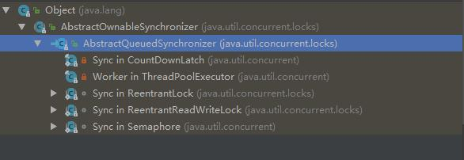

# java.util.concurrent.locks.AbstractQueuedSynchronizer

## 简介

提供给阻塞锁和基于FIFO等待序列的相关同步器实现的一个框架。此类设计给那些依靠一个int来表示状态的同步器。子类必须定义方法去改变状态，
比如，acquired和released。然，由于要确保同步，子类需使用 `getState`, `setState` and `compareAndSetState`方法获取或更新状态。

子类最好被定义为非公共(non-public)内部(internal)工具类，供其封闭类（enclosing类，不懂译得对否，即相对来说前者是嵌套类，Nested class）。

此锁类支持排他模式和共享模式。在排他模式中，其他线程将不能成功获取到此锁。通常，子类实现仅支持其中一种模式，但例如，ReadWriteLock
是可以同时使用两种模式。

该类还定义了一个嵌套的 AbstractQueuedSynchronizer.ConditionObject类，它能给那些是排他实现的子类提供支持。

序列化该类仅存了原子int状态值，所以反序列化后的类会是空线程队列。

要使用该类作为同步器的基本机构，需重新定义如下方法去检测和修改同步int状态：

* tryAcquire
* tryRelease
* tryAcquireShared
* tryReleaseShared
* isHeldExclusively

这些方法的内部实现必须是线程安全的，且应是短的非阻塞的。实现这些方法是使用该类的唯一的真正方式。

AQS的继承结构：

可看到，比如ThreadPoolExecutor，ReentrantLock,CountDownLaunch,Semaphore等Concurrent包下的核心类都在内部实现了此类，
还有一些比如CyclicBarrier是使用了ReentrantLock。由此可见，AQS的价值。

## 源码阅读

作者是Doug Lea老爷子 :-)

AQS的核心是静态内部final类Node。归纳介绍几点：
1. 此Node类是等待队列的节点类。而该等待队列的实现是"CLH"锁队列的变种。CLH锁一般用于自旋锁。我们是用该结构去维护一些
关于持有线程的队列节点关系的控制信息，而不是用它作为阻塞同步器。
2. 位于队列首部的可能会尝试acquire,但不能保证能成功acquire。
3. 入队列就是通过拼接一个新的尾节点，出队列，则是需设置head属性。

## references

[1] [Washington University | Spin Locks and Contention](https://www.cse.wustl.edu/~angelee/archive/cse539/spr15/lectures/locks.pdf)

