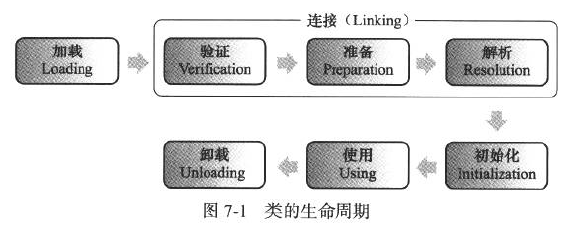

# ClassLoader

记得最先接触到ClassLoader大概从“双亲委派”这词开始，那时刚学Java，仅知道有这个词而已。后来，碰到了几乎人人都会碰到的ClassNotFoundExcetpion 后，
逐渐才意识到ClassLoader的存在。

## ClassLoader是什么

Java8 doc中是这样介绍的。。
>A class loader is an object that is responsible for loading classes. The class ClassLoader is an abstract class. Given the binary name of a class, a class loader should attempt to locate or generate data that constitutes a definition for the class. A typical strategy is to transform the name into a file name and then read a "class file" of that name from a file system.

ClassLoader在Java语言中占据了非常重要的地位，Java中的所有类，必须被加载到jvm中才能运行，这个加载工作是由Java中的类加载器完成的。

而且Java应用服务器，OSGi，以及大量的网络框架企业级框架，它们大多数都自定义了自己的ClassLoader。

## JVM类加载机制

由于，本篇讨论的是`ClassLoader`，所以，本节仅说下大致的结构，更多细节请看[深入理解Java虚拟机[9]](#references)，下图及一些描述也是取自该书。

一个java文件从被加载到被卸载这个生命过程，总共要经历5个阶段，JVM将类加载过程分为：

注意，该顺序为“开始”顺序，但是，它们的执行过程中是会有交叉的（即，不是一个阶段结束另一个才开始）。

#### 加载

1. 通过一个类的全限定名来获取定义此类的二进制字节流。
2. 将这个字节流所代表的静态存储结构转化为方法区的运行时数据结构。
3. 在内存中生成一个代表这个类的`java.lang.Class`对象，作为方法区这个类的各种数据的访问入口。

**虚拟机的设计，把 1.这个动作放到JVM外部实现，实现这个动作的代码模块称为"类加载器"(ClassLoader)。**
这也是，我本篇学习和讨论的重点。

#### 验证

这一阶段的主要目的是为了确保Class文件的字节流中包含的信息是否符合当前虚拟机的要求，并且不会危害虚拟机自身的安全。

需注意，如下语句，在准备阶段过后，初始值为0而不是123
~~~

public static int value = 123;

~~~

但是，某些情况，如果类字段的字段属性表中存在ConstantValue属性，那在准备阶段变量value就会被初始化为ConstantValue的值。例如，下面的语句准备阶段过后，值为123：

~~~

public static final int value = 123;

~~~

#### 准备

准备阶段是正式为*类变量*分配内存并设置类变量*初始值*的阶段，这些变量所使用的内存都将在方法区中进行分配。

#### 解析

解析阶段是指虚拟机将常量池中的*符号引用*替换为*直接引用*的过程。

符号引用的目标并不一定要已经加载到内存中，但直接引用的目标必定已在内存。

#### 初始化

初始化阶段是执行类构造器<client>方法的过程。
<client>方法是由编译器自动手机类变量的赋值动作和静态语句块（static{}块）中的语句合并产生。

## 一般Java程序的ClassLoader的hierarchy

下面是stackOverflow上的图： [ [1] ](#references)

可从如下代码验证：
[include:10-](../../javacode/src/main/java/com/tea/lang/classloader/ShowClassLoadersMain.java)
输出是：
~~~
sun.misc.Launcher$AppClassLoader@18b4aac2
sun.misc.Launcher$ExtClassLoader@606d8acf
null
~~~
Laucher是Java程序的入口。可看出ClassLoader的层次，ShowClassLoadersMain是由AppClassLoader加载的，
AppClassLoader的parent是ExtClassLoader，但ExtClassLoader的parent是null，是该parent指的是上图的Bootstrap ClassLoader，
是由C++语言写的，在java的视角上，是不存在Bootstrap Loader的类实体的。

为什么会有三个或更多？

主要是为了分工:
* Bootstrap ClassLoader负责加载系统类
* ExtClassLoader负责加载扩展类
* AppClassLoader负责加载应用类
* 一些用户自定义的ClassLoader

当然，这三者的分工可看考Java官方的文档(tools reference)，里面有对于它们分工的细节、如何自定义有更详尽的描述：

[Java Platform, Standard Edition Tools Reference | How the Java Runtime Finds Classes](http://docs.oracle.com/javase/8/docs/technotes/tools/windows/findingclasses.html#A1012444)

ClassLoader的核心抽象类：
~~~
public abstract class ClassLoader
~~~

**如下会浅析ClassLoader的重点部分**

## 重点

### loadClass方法的实现方式

这是很重要的方法。
~~~
protected Class> loadClass(String name, boolean resolve)
        throws ClassNotFoundException
    {
        synchronized (getClassLoadingLock(name)) {
            // First, check if the class has already been loaded
            Class c = findLoadedClass(name);
            if (c == null) {
                long t0 = System.nanoTime();
                try {
                    if (parent != null) {
                        c = parent.loadClass(name, false);
                    } else {
                        c = findBootstrapClassOrNull(name);
                    }
                } catch (ClassNotFoundException e) {
                    // ClassNotFoundException thrown if class not found
                    // from the non-null parent class loader
                }

                if (c == null) {
                    // If still not found, then invoke findClass in order
                    // to find the class.
                    long t1 = System.nanoTime();
                    c = findClass(name);

                    // this is the defining class loader; record the stats
                    sun.misc.PerfCounter.getParentDelegationTime().addTime(t1 - t0);
                    sun.misc.PerfCounter.getFindClassTime().addElapsedTimeFrom(t1);
                    sun.misc.PerfCounter.getFindClasses().increment();
                }
            }
            if (resolve) {
                resolveClass(c);
            }
            return c;
        }
    }
~~~

逐行来看，<code>synchronized (getClassLoadingLock(name))</code>返回一个对象锁。

~~~
protected Object getClassLoadingLock(String className) {
        Object lock = this;
        if (parallelLockMap != null) {
            Object newLock = new Object();
            lock = parallelLockMap.putIfAbsent(className, newLock);
            if (lock == null) {
                lock = newLock;
            }
        }
        return lock;
    }
~~~
以上是getClassLoadingLock(name)方法的实现细节，我们看到这里用到变量parallelLockMap ，
根据这个变量的值进行不同的操作，如果这个变量是Null，那么直接返回this，如果这个属性不为Null，
那么就新建一个对象，然后在调用一个putIfAbsent(className, newLock);

parallelLockMap是一个ConcurrentHashMap。
~~~
private final ConcurrentHashMap parallelLockMap;
~~~
这个lockMap是在ClassLoader初始化时创建的（可看ClassLoader的构造方法）。

>首先，在ClassLoader类中有一个静态内部类ParallelLoaders，
他会指定的类的并行能力，如果当前的加载器被定位为具有并行能力，
那么他就给parallelLockMap定义，就是new一个 ConcurrentHashMap()，
那么这个时候，我们知道如果当前的加载器是具有并行能力的，那么parallelLockMap就不是Null，
这个时候，我们判断parallelLockMap是不是Null，如果他是null，说明该加载器没有注册并行能力，
那么我们没有必要给他一个加锁的对象，getClassLoadingLock方法直接返回this,
就是当前的加载器的一个实例。如果这个parallelLockMap不是null，那就说明该加载器是有并行能力的，
那么就可能有并行情况，那就需要返回一个锁对象。然后就是创建一个新的Object对象，
调用parallelLockMap的putIfAbsent(className, newLock)方法，
这个方法的作用是：首先根据传进来的className,检查该名字是否已经关联了一个value值，如果已经关联过value值，
那么直接把他关联的值返回，如果没有关联过值的话，那就把我们传进来的Object对象作为value值，
className作为Key值组成一个map返回。然后无论putIfAbsent方法的返回值是什么，
都把它赋值给我们刚刚生成的那个Object对象。 这个时候，我们来简单说明一下getClassLoadingLock(String className)的作用，
就是： 为类的加载操作返回一个锁对象。
为了向后兼容，这个方法这样实现:如果当前的classloader对象注册了并行能力，方法返回一个与指定的名字className相关联的特定对象，否则，直接返回当前的ClassLoader对象。

紧接着看着行，来自jdk源码的注释，表示<code>findLoadedClass</code>方法是为了检查该类是否已被加载，如果已加载那么直接返回该对象。

（当然这一方法还涉及一个知识点，SystemDictionary[[2]](#references)）
~~~
 // First, check if the class has already been loaded
            Class<?> c = findLoadedClass(name);
~~~

如果，该类没有被加载过，那么执行以下的加载过程

~~~
try {
    if (parent != null) {
           c = parent.loadClass(name, false);
    } else {
            c = findBootstrapClassOrNull(name);
     }
} catch (ClassNotFoundException e) {
         // ClassNotFoundException thrown if class not found
          // from the non-null parent class loader
}
~~~
如果父加载器不为空，那么调用父加载器的loadClass方法加载类，如果父加载器为空，那么调用虚拟机的加载器来加载类。

该代码块执行过程也是双亲委派模式的体现所在。

如果以上两个步骤都没有成功的加载到类，那么调用自己的findClass(name)方法来加载类。一般自实现的ClassLoader可选择Override该方法来添加自己的loadclass逻辑，实现自定义类加载。

### 显式隐式加载类
显示：
1. this.getClass().getClassLoader().loadClass()
2. Class.forName()
3. MyClassLoader.findClass()

隐式：
1. new instance()
2. ClassName.属性或方法名

### 类加载器问题对照表
| 类找不到 | 加载了不正确的类 | 多于一个类被加载  |
| :---: | :---: | :---: |
| ClassNotFoundException NoClassDefFoundError| IncompatibleClassChangeError NoSuchMethodError NoSuchFieldError IllegalAccessError | ClassCastException LinkageError |
| IDE class lookup (Ctrl+Shift+T in Eclipse);find . -name “*.jar” -exec jar -tf {} \; 使用middleware-detector; 命令行打包jar; 解包war去找问题 | 通过在启动参数中加 -verbose:class，观察加载的类来自哪个jar包使用middelware-detector | 通过`-verbose:class`观察 |

## references
[1] [stackoverflow | Diffrenence between AppClassloader and SystemClassloader](https://stackoverflow.com/questions/34650568/diffrenence-between-appclassloader-and-systemclassloader)

[2] [ifeve | ClassLoader ](http://ifeve.com/classloader/)

[3] [csdn | java中类的加载顺序介绍(ClassLoader) ](http://blog.csdn.net/eff666/article/details/52203406)

[4] [深度分析 Java 的 ClassLoader 机制（源码级别）](http://blog.jobbole.com/96145/)

[5] [csdn | ClassLoader源码分析 ](http://blog.csdn.net/vking_wang/article/details/17162327)

[6] [Java Platform, Standard Edition Tools Reference](http://docs.oracle.com/javase/8/docs/technotes/tools/windows/toc.html)

[7]周志明.深入理解Java虚拟机:JVM高级特性与最佳实践,第2版.中国:机械工业出版社,2013
