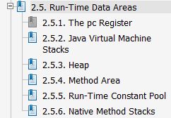

# java.lang.String

String是字符串常量，java.lang.String是一个不可变类。

## 与String有关的语法特性

### switch语法糖

java7加入了新的语法特性，使得switch语法能够将String作为判断条件。

例如：
[include:7-](../../javacode/src/main/java/com/tea/lang/string/SwitchStringMain.java)
可将如上代码反编译可得如下(class文件为java8)：
[include:8-](SwitchStringMain.class.txt)

由上面可看出switch字符串是通过hashcode()和equal()实现的。
记住，实际上switch只能使用**整型**。而且，这种方式比一般纯用equal的if…else…块的效率要高。

当然，当我们在使用java6及以下版本时，可适当的通过模仿上面的方式优化字符串的if……else……块。

### "+"和"+="操作符重载

> 用于String的“+”与“+=”是Java中仅有的两个重载过的操作符。[[1]](#references)

具体可参看如下代码及其反编译结果：
[include:7-](../../javacode/src/main/java/com/tea/lang/string/StringPlusMain.java)

[include:8-](StringPlusMain.class.txt)

如上，在拼接s2时，我们能够发现，将字符串的相”+“转换为使用了StringBuilder类的append。

不过,这里有个小坑。
看如下：
[include:7-](../../javacode/src/main/java/com/tea/lang/string/WhitherStringBuilderMain.java)
使用javap -c 命令可得如下
[include:8-](WhitherStringBuilderMain.class.javap.txt)

注意第一个方法，在如下代码行，它表明循环的边界，当当前循环结束会返回第5行。
~~~
35: goto          5
~~~
在循环的中间的行里面，将+=拼接的字符串改为了使用StringBuilder的append()，而且是每次循环都新建一个StringBuilder对象。
所以，在运行这段代码时，会产生一堆的对象。代码质量、性能自然差。

但是，有时并不能只通过字节码来判断两代码块的性能。
> 性能问题不能只通过分析字节码来判断。 如果对比双方的字节码完全一样，则可以确定它们的性能会一样；但如果对比双方的字节码不一样，并不能只看字节码就说某一方比另一方更快。这是因为字节码只是程序语义的载体，并不等价于最终执行时的形态——字节码在高性能JVM里被优化的JIT编译器编译过后，其性能可能跟原本的字节码有很大差异，只分析字节码是不靠谱的。

以上节选自[ [2] 知乎 | javap生成的汇编语言怎么看？- RednaxelaFX的回答 ](https://www.zhihu.com/question/49470442/answer/182612198/).
那么要准确的分析两代码块性能，我认为应在具体场景结合具体的测试用例分析。

### string不可变性

发现这篇文章挺好的，就不写了。
[ [4] HollisChuang's Blog | 为什么Java要把字符串设计成不可变的 ](http://www.hollischuang.com/archives/1246)

## String池

### Run-Time Data Areas

先简单介绍下jvm运行时虚拟内存的划分（该图取自Java Virtual Machine Specification[[6]](#references)的目录）：

我简单介绍下，具体可参考jvms第2章第5节[2.5. Run-Time Data Areas](http://docs.oracle.com/javase/specs/jvms/se8/html/jvms-2.html#jvms-2.5)

程序计数器（The pc Register）是jvm执行程序的流水线。

本地方法栈（Native Method Stacks）是jvm调用操作系统方法所使用的栈。

虚拟机栈（Java Virtual Machine Stacks）是jvm执行java代码所使用的栈。

方法区（Method Area）存放了一些常量、静态变量、类信息等，可以理解成class文件在内存中的存放位置；其中包含了运行时常量池（Run-Time Constant Pool）。

虚拟机堆（Heap）是jvm执行java代码所使用的堆。

### 常量池

那么Java（特指HotSpot VM，因为[ [6] The Java Virtual Machine Specification ][link: The Java Virtual Machine Specification]是没有关于字符串常量池的描述的）都有哪些常量池？（以下引自[[9]](#references)）

>1. Class文件中的常量池
>
>这里面主要存放两大类常量：
>* 字面量(Literal)：文本字符串等
>* 符号引用(Symbolic References)：属于编译原理方面的概念，包含三类常量：
>
>   *  类和接口的全限定名(Full Qualified Name)
>   *  字段的名称和描述符(Descriptor)
>   *  方法的名称和描述符

> 这个用javap看一下就能明白，这里只涉及字符串就不谈其他的了。
> 简单地说，用双引号引起来的字符串字面量都会进这里面。

>2. 运行时常量池
>
>方法区的一部分。Class文件中除了有类的版本、字段、方法、接口等描述信息外，还有常量池(Constant Pool Table)，
存放编译期生成的各种字面量和符号引用，这部分内容将在类加载后进入方法区的运行时常量池。

>3. 全局字符串常量池
>
>HotSpot VM里，记录interned string的一个全局表叫做StringTable，它本质上就是个weak HashMap。
这是个纯运行时的结构，而且是惰性（lazy）维护的。注意它只存储对java.lang.String实例的引用，而不存储String对象的内容。
注意，它只存了引用，根据这个引用可以得到具体的String对象。
>一般我们说一个字符串进入了全局的字符串常量池其实是说在这个StringTable中保存了对它的引用，反之，如果说没有在其中就是说StringTable中没有对它的引用。

### StringTable

说到讨论的重点--全局字符串常量池了。HotSpot VM的StringTable存在于堆（heap）中(java6是存在于<code>PermGen</code>中,7后存在于堆中)。

#### 字面量何时进入字符串常量池StringTable

这篇文章[[9]"字面量" 是何时进入字符串常量池的?][link: 知乎 | Java 中new String("字面量") 中 "字面量" 是何时进入字符串常量池的?- 木女孩的回答]几点：

>JVM规范里明确指定resolve阶段可以是lazy的。

>在HotSpot VM中，运行时常量池里，
>
>CONSTANT_Utf8 -> Symbol*（一个指针，指向一个Symbol类型的C++对象，内容是跟Class文件同样格式的UTF-8编码的字符串）
>
>CONSTANT_String -> java.lang.String（一个实际的Java对象的引用，C++类型是oop）
>
>CONSTANT_String则是lazy resolve的，例如说在第一次引用该项的ldc指令被第一次执行到的时候才会resolveCONSTANT_String则是lazy resolve的，例如说在第一次引用该项的ldc指令被第一次执行到的时候才会resolve

>看到这里想必也就明白了， 就HotSpot VM的实现来说，加载类的时候，那些字符串字面量会进入到当前类的运行时常量池，不会进入全局的字符串常量池（即在StringTable中并没有相应的引用，在堆中也没有对应的对象产生）

上面说的**resolve阶段可以是lazy**在这里提及：[jvms Chapter 5.4. Linking](http://docs.oracle.com/javase/specs/jvms/se8/html/jvms-5.html#jvms-5.4) says
>For example, a Java Virtual Machine implementation may choose to resolve each symbolic reference in a class or interface individually when it is used ("lazy" or "late" resolution), or to resolve them all at once when the class is being verified ("eager" or "static" resolution).

总的来说，以上说了在执行ldc指令（即运行代码）时，才会加载进全局的字符串常量池。

以下是openjdk中的ldc方法
~~~
IRT_ENTRY(void, InterpreterRuntime::ldc(JavaThread* thread, bool wide))
  // access constant pool
  constantPoolOop pool = method(thread)->constants();
  int index = wide ? get_index_u2(thread, Bytecodes::_ldc_w) :get_index_u1(thread, Bytecodes::_ldc);
  constantTag tag = pool->tag_at(index);

  if (tag.is_unresolved_klass() || tag.is_klass()) {
    klassOop klass = pool->klass_at(index, CHECK);
    oop java_class = klass->java_mirror();
    thread->set_vm_result(java_class);
  } else {
#ifdef ASSERT
    // If we entered this runtime routine, we believed the tag contained
    // an unresolved string, an unresolved class or a resolved class.
    // However, another thread could have resolved the unresolved string
    // or class by the time we go there.
    assert(tag.is_unresolved_string()|| tag.is_string(), "expected string");
#endif
    oop s_oop = pool->string_at(index, CHECK);
    thread->set_vm_result(s_oop);
  }
IRT_END
~~~
因为是字符串常量，代码调用了pool->string_at(index, CHECK) ，最后代码调用了string_at_impl方法
~~~
oop constantPoolOopDesc::string_at_impl(constantPoolHandle this_oop, int which, TRAPS) {
  oop str = NULL;
  CPSlot entry = this_oop->slot_at(which);
  if (entry.is_metadata()) {
    ObjectLocker ol(this_oop, THREAD);
    if (this_oop->tag_at(which).is_unresolved_string()) {
      // Intern string
      Symbol* sym = this_oop->unresolved_string_at(which);
      str = StringTable::intern(sym, CHECK_(constantPoolOop(NULL)));
      this_oop->string_at_put(which, str);
   } else {
      // Another thread beat us and interned string, read string from constant pool
     str = this_oop->resolved_string_at(which);
    }
  } else {
    str = entry.get_oop();
  }
  assert(java_lang_String::is_instance(str), "must be string");
  return str;
}
~~~
看方法名当`is_unresolved_string()`时，会调用`StringTable::intern`塞进StringTable中。

所以，即在lazy resolve时才塞进池中是有可能的，但如何证明是lazy resolve呢。

于是，我在stackoverflow上提了个问题，得出答案：[ [10]stackoverflow | the timing of String Literal loaded into StringTable in Java HotSpot vm][link: stackoverflow | the timing of String Literal loaded into StringTable in Java HotSpot vm]

由如下代码块可知，HotSpot VM是Lazy resolve，且String Literal（字符串字面量）是Lazy resolve（注，我的讨论base在Java8，java6如下亲测并不是lazy resolve）。
[include:7-](../../javacode/src/main/java/com/tea/lang/string/LazyResolveTestMain.java)

PS.同时发现了一个网页运行代码的好工具[ideone](http://ideone.com/FrIAOX)。

#### 如何使实例化的字符串进入StringTable

[`intern()`](#方法intern)方法，可使实例化后的调用该方法的字符串，与StringTable进行比对，
不存在则将该字符串引用塞进StringTable，并返回其引用。

#### 如何限定StringTable的大小

使用`-XX:StringTableSize=N`（N为int，条数）可限定StringTable的大小（StringTable是fixed的）。

java6 默认`1009`

java7后 默认为`60013`

#### StringTable分析参数

加上`-XX:+PrintStringTableStatistics` 参数后，在Java Application运行结束前，会打印出一个本次运行的StringTable分析报告。

#### 其他

对了，有几个测试可玩下，猜下输出：
[include:7-](../../javacode/src/main/java/com/tea/lang/string/FinalStringMain.java)

至于为什么，答案在如下3个链接中：
[3.10.5. String Literals](http://docs.oracle.com/javase/specs/jls/se8/html/jls-3.html#jls-StringLiteral)
[15.28. Constant Expressions](http://docs.oracle.com/javase/specs/jls/se8/html/jls-15.html#jls-15.28)
[4.12.4. final Variables](http://docs.oracle.com/javase/specs/jls/se8/html/jls-4.html#jls-4.12.4)

以下两个测试出自[[9]](#references):
~~~
class NewTest1{
    public static String s1="static";
    public static void main(String[] args) {
        String s1=new String("he")+new String("llo");
        s1.intern();
        String s2="hello";
        System.out.println(s1==s2);
    }
}
~~~

~~~
class NewTest2{
    public static void main(String[] args) {
        String s1=new String("he")+new String("llo");
        String s2=new String("h")+new String("ello");
        String s3=s1.intern();
        String s4=s2.intern();
        System.out.println(s1==s3);
        System.out.println(s1==s4);
    }
}
~~~

#### 性能

这篇文章里涵盖了Java6,7,8 StringTable的性能测试结果[ [7] ](http://java-performance.info/string-intern-in-java-6-7-8/)。

## 源码学习

没开始看前，先立个flag。。其实我觉得String类（也包括大多数类）的大部分地方都有JavaDoc讲解其用法或一些关键点，
所以，我看的时候只会在写一些有关关键结构或核心属性、方法或一些对我来说有学习价值的点的笔记。

`java.lang.String`实现了序列化接口。
实现了CharSequence，说明存在字符序列结构。
还有实现了Comparable接口，说明该类存在内在的排序关系(natural ordering)，关于实现了该接口的一些特点将在[Comparable接口](Comparable.md)说明。

`String`就是使用字符数组(char[] value)实现的。构造器都是围绕`private final char value[];`去实现的。
含有`byte[]`作为构造器参数的构造器，如果其参数中没指定charset，那么调用系统默认的编码格式。

### 方法hashCode()

注：该段在开搞Object类时将迁移到其[hashCode()]()方法上。

#### hashCode的目的和实现原理

在说到String的hashcode的具体实现前，先谈谈hashCode的目的和实现。

##### hashCode方法约定

以下是Object的hashCode的约定，摘自Java doc(JavaSE8):

>The general contract of hashCode is:
>* Whenever it is invoked on the same object more than once during an execution of a Java application, the hashCode method must consistently return the same integer, provided no information used in equals comparisons on the object is modified. This integer need not remain consistent from one execution of an application to another execution of the same application.
>* If two objects are equal according to the equals(Object) method, then calling the hashCode method on each of the two objects must produce the same integer result.
>* It is not required that if two objects are unequal according to the equals(Object) method, then calling the hashCode method on each of the two objects must produce distinct integer results. However, the programmer should be aware that producing distinct integer results for unequal objects may improve the performance of hash tables.

简单来说，
第一点，同一对象在核心域（equals方法用到的信息）没有被修改时，被多次调用`hashCode`函数，其返回的值应始终如一。
第二点，`equals`方法返回的结果为相等，那么两者`hashCode`方法也必须相等。
第三点，但`equals`方法不等时，两者`hashCode`却被允许可以相等。

##### hashCode的目的

在我以前的思考里，我觉得`hashCode()`应该是反映该类的核心属性、核心数据结构，从而对于外部能反映其区分特征的一个方法。

当然，
1. 现在从[hashCode方法约定](#hashCode方法约定)中可看出，其实简单说，能反映equals方法用到的信息就可以。
2. effective java[[13]](#references)中说到，一个好的散列函数应当是：
    > 理想情况下，散列函数应该吧集合中不相等的实例均匀地分布到所有可能的散列值上。

    并且javadoc有如下提议：
    >the programmer should be aware that producing distinct integer results for unequal objects may improve the performance of hash tables.

第二点虽说并不是硬性要求，但我之所以罗列上是因为，当我们重写了equals、hashCode方法后，
我们会有挺大几率会将其与一些HashMap等等的集合、一些方法应用到一起。且，在对该对象进行比较时，选择性的使用如[switch语法糖](#switch语法糖)的用法进行比较对性能也是好的。

##### hashCode方法实现的范式

Effective Java第9条[[13]](#references)给出了书写hashCode的一般方式。
>1. 把某个非零常数值，比如说17，保存在一个叫result的int类型的变量中。
>2. 对于对象中每一个关键域f（指equals方法中考虑的每一个域），完成以下步骤：
   a.为该域计算int类型的散列码c：
       i.如果该域是boolean类型，则计算(f ? 0 : 1)。
       ii.如果该域是byte、char、short或者int类型，则计算(int)f。
       iii.如果该域是long类型，则计算(int)(f^(f>>>32))。
       iv.如果该域是float类型，则计算Float.floatToIntBits(f)。
       v.如果该域是double类型，则计算Double.doubleToLongBits(f)得到一个long类型的值，然后  按照步骤2.a.iii，对该long型值计算散列值。
       vi.如果该域是一个对象引用，并且该类的equals方法通过递归调用equals的方式来比较这个域，则同样对这个域递归调用hashCode。如果要求一个更为复杂的比较，则为这个域计算一个“规范表示（canonical representation）”，然后针对这个范式表示调用hashCode。如果这个域的值为null,则返回0（或者其他某个常数，但习惯上使用0）。
       vii.如果该域是一个数组，则把每一个元素当做单独的域来处理。也就是说，递归地应用上述规则，对每个重要的元素计算一个散列码，然后根据步骤2.b中的做法把这些散列值组合起来。
   b.按照下面的公式，把步骤a中计算得到的散列码c组合到result中：result=result*31+c
>3.返回result。
>4.写完了hashCode方法之后，问自己“是否相等的实例具有相等的散列码”。如果不是的话，找出原因，并修正错误。

>之所以选择31，是因为它是个奇素数，如果乘数是偶数，并且乘法溢出的话，信息就会丢失，因为与2相乘等价于移位运算。
使用素数的好处并不是很明显，但是习惯上都使用素数来计算散列结果。
31有个很好的特性，就是用移位和减法来代替乘法，可以得到更好的性能：31*i==(i<<5)-i。现在的VM可以自动完成这种优化。

事实上，对于选择31仍然有争议，具体参考[[14]](#references)。当然，对于选31还是选73、37等等，差别不算大。

#### String hashCode

String的hashcode方法的算法如下：
~~~
s[0]*31^(n-1) + s[1]*31^(n-2) + ... + s[n-1]
~~~

### replaceFirst、replaceAll、replace区别

~~~
String replaceFirst(String regex, String replacement)
String replaceAll(String regex, String replacement)
String replace(CharSequence target, CharSequence replacement)
~~~

1. replace的参数是char和CharSequence,即可以支持字符的替换,也支持字符串的替换
2. replaceAll和replaceFirst的参数是regex,即基于规则表达式的替换,
比如,可以通过replaceAll(“\d”, “*”)把一个字符串所有的数字字符都换成星号;
相同点是都是全部替换,即把源字符串中的某一字符或字符串全部换成指定的字符或字符串,
如果只想替换第一次出现的,可以使用 replaceFirst(),这个方法也是基于规则表达式的替换,但与replaceAll()不同的是,只替换第一次出现的字符串;
另外,如果replaceAll()和replaceFirst()所用的参数据不是基于规则表达式的,则与replace()替换字符串的效果是一样的,即这两者也支持字符串的操作;

### 方法intern()

intern方法的源码：
~~~
JVM_ENTRY(jstring, JVM_InternString(JNIEnv *env, jstring str))
  JVMWrapper("JVM_InternString");
  JvmtiVMObjectAllocEventCollector oam;
  if (str == NULL) return NULL;
  oop string = JNIHandles::resolve_non_null(str);
  oop result = StringTable::intern(string, CHECK_NULL);
  return (jstring) JNIHandles::make_local(env, result);
JVM_END

oop StringTable::intern(Handle string_or_null, jchar* name,
                        int len, TRAPS) {
  unsigned int hashValue = hash_string(name, len);
  int index = the_table()->hash_to_index(hashValue);
  oop string = the_table()->lookup(index, name, len, hashValue);

  // Found
  if (string != NULL) return string;

  // Otherwise, add to symbol to table
  return the_table()->basic_add(index, string_or_null, name, len,
                                hashValue, CHECK_NULL);
}
~~~

intern方法的用途吧，我认为作用不大。它的用途可用于debug;

或者，当我们确信这个String会在运行中的系统内多次新建，那么可调用String.intern并使用其返回的String引用。

## references

[1] Bruce Eckel.Java编程思想,第四版[M].中国:机械工业出版社，2007

[2] [知乎 | javap生成的汇编语言怎么看？- RednaxelaFX的回答 ](https://www.zhihu.com/question/49470442/answer/182612198/)

[3] [知乎 | javap生成的汇编语言怎么看？- zhisheng的回答 ](https://www.zhihu.com/question/49470442/answer/135812845)

[4] [ hollischuang | 为什么Java要把字符串设计成不可变的 ](http://www.hollischuang.com/archives/1246)

[5] [ The Java Language Specification, Java SE 8 Edition ](http://docs.oracle.com/javase/specs/jls/se8/html/index.html)

[6] [ The Java Virtual Machine Specification, Java SE 8 Edition ](http://docs.oracle.com/javase/specs/jvms/se8/html/index.html)

[7] [ String.intern in Java 6, 7 and 8 – string pooling ](http://java-performance.info/string-intern-in-java-6-7-8/)

[8] [ RednaxelaFX.iteye | 请别再拿“String s = new String("xyz");创建了多少个String实例”来面试了吧 ](http://rednaxelafx.iteye.com/blog/774673)

[9] [ 知乎 | Java 中new String("字面量") 中 "字面量" 是何时进入字符串常量池的?- 木女孩的回答 ][link: 知乎 | Java 中new String("字面量") 中 "字面量" 是何时进入字符串常量池的?- 木女孩的回答]

[10] [stackoverflow | the timing of String Literal loaded into StringTable in Java HotSpot vm][link: stackoverflow | the timing of String Literal loaded into StringTable in Java HotSpot vm]

[11] [csdn | Java (JDK7)中的String常量和String.intern的实现](http://blog.csdn.net/raintungli/article/details/38595573)

[12] [JVM Anatomy Park #10: String.intern()](https://shipilev.net/jvm-anatomy-park/10-string-intern/)

[13] Joshua Blosh.Effective Java,第2版[M].中国:机械工业出版社，2009

[14] [stackoverflow | Why does Java's hashCode() in String use 31 as a multiplier?](https://stackoverflow.com/questions/299304/why-does-javas-hashcode-in-string-use-31-as-a-multiplier%EF%BC%89)

[15] [ImportNew | 使用String的intern方法节省内存](http://www.importnew.com/21836.html)

[link: The Java Language Specification]: http://docs.oracle.com/javase/specs/jls/se8/html/index.html
[link: The Java Virtual Machine Specification]: http://docs.oracle.com/javase/specs/jvms/se8/html/index.html
[link: 知乎 | Java 中new String("字面量") 中 "字面量" 是何时进入字符串常量池的?- 木女孩的回答]: https://www.zhihu.com/question/55994121
[link: stackoverflow | the timing of String Literal loaded into StringTable in Java HotSpot vm]: https://stackoverflow.com/questions/44924564/the-timing-of-string-literal-loaded-into-stringtable-in-java-hotspot-vm/44929935#44929935

