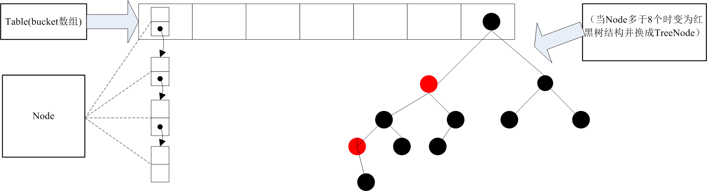

# java.util.HashMap

一般深入阅读前，我习惯先扫下开头的类的Java doc。里面有如下信息点：

* HashMap是Java集合框架中的一员。它是基于`Map`接口实现的一个哈希表。

* 它允许插入null的key和null的value。它的存储结点的结构叫bucket。

* 两个影响到性能的参数：初始容量和加载因子。

* 当哈希表中的条目数超出了加载因子与当前容量的乘积时，则要对该哈希表进行 rehash 操作（即重建内部数据结构），从而哈希表将具有大约两倍的桶数。

* 该实现不是同步的。可使用`Collections.synchronizedMap(new HashMap(...));`“封装”一个简单的同步的map，但需注意一点，这个返回的迭代器都是快速失败的。

* 作者是四位神 :smiley:： Doug Lea、Josh Bloch、Arthur van Hoff、Neal Gafter。

## 是什么？为了解决什么问题？

从目的来讲，HashMap是一个存储键值对的集合，也就是符号表。往细里说，如上叙，
是基于`Map`接口实现的一个哈希表。

## 内部实现

先简单说说存储结构，在说下重要属性，最后说下重点方法。

### 存储结构

### 重要属性

~~~

transient Node<K,V>[] table; //存储Node bucket的数组

transient int size; //存储的key-value对的总量

int modCount;  //记录集合结构变化的次数，用于快速失败等等

int threshold; //所能容纳的key-value对总数，当集合的key-value对大于该值resize

final float loadFactor; //加载因子，默认0.75，一般不要改

~~~

关于table这数组的length为什么必须为2的倍数(JavaDoc中有`capacity MUST be a power of two.`)？
摘自[美团点评技术团队 | Java 8系列之重新认识HashMap][link:4]:
>在HashMap中，哈希桶数组table的长度length大小必须为2的n次方(一定是合数)，这是一种非常规的设计，
常规的设计是把桶的大小设计为素数。相对来说素数导致冲突的概率要小于合数，具体证明可以参考http://blog.csdn.net/liuqiyao_01/article/details/14475159，
Hashtable初始化桶大小为11，就是桶大小设计为素数的应用（Hashtable扩容后不能保证还是素数）。HashMap采用这种非常规设计，主要是为了在取模和扩容时做优化，
同时为了减少冲突，HashMap定位哈希桶索引位置时，也加入了高位参与运算的过程。

### 方法

#### put

~~~
    /**
     * Associates the specified value with the specified key in this map.
     * If the map previously contained a mapping for the key, the old
     * value is replaced.
     *
     * @param key key with which the specified value is to be associated
     * @param value value to be associated with the specified key
     * @return the previous value associated with <tt>key</tt>, or
     *         <tt>null</tt> if there was no mapping for <tt>key</tt>.
     *         (A <tt>null</tt> return can also indicate that the map
     *         previously associated <tt>null</tt> with <tt>key</tt>.)
     */
    public V put(K key, V value) {
        return putVal(hash(key), key, value, false, true);
    }
~~~

首先看下，hash方法：

~~~
    /**
     * Computes key.hashCode() and spreads (XORs) higher bits of hash
     * to lower.  Because the table uses power-of-two masking, sets of
     * hashes that vary only in bits above the current mask will
     * always collide. (Among known examples are sets of Float keys
     * holding consecutive whole numbers in small tables.)  So we
     * apply a transform that spreads the impact of higher bits
     * downward. There is a tradeoff between speed, utility, and
     * quality of bit-spreading. Because many common sets of hashes
     * are already reasonably distributed (so don't benefit from
     * spreading), and because we use trees to handle large sets of
     * collisions in bins, we just XOR some shifted bits in the
     * cheapest possible way to reduce systematic lossage, as well as
     * to incorporate impact of the highest bits that would otherwise
     * never be used in index calculations because of table bounds.
     */
    static final int hash(Object key) {
        int h;
        return (key == null) ? 0 : (h = key.hashCode()) ^ (h >>> 16);
    }

~~~

为什么要多算这一步hash呢？

因为通过`h >>> 16`并异或`h`能使，在HashMap的`Node<K,V>[] table`的length还小时，
key的哈希值的高位更充分参与到定位bucket的过程。(注意下文中`tab[i = (n - 1) & hash]`)。

拓展阅读：[美团点评技术团队 | Java 8系列之重新认识HashMap][link:4]的"确定哈希桶数组索引位置"一小节。

~~~
    /**
     * Implements Map.put and related methods
     *
     * @param hash hash for key
     * @param key the key
     * @param value the value to put
     * @param onlyIfAbsent if true, don't change existing value
     * @param evict if false, the table is in creation mode.
     * @return previous value, or null if none
     */
    final V putVal(int hash, K key, V value, boolean onlyIfAbsent,
                   boolean evict) {
        Node<K,V>[] tab; Node<K,V> p; int n, i;
        if ((tab = table) == null || (n = tab.length) == 0)
            n = (tab = resize()).length;
        if ((p = tab[i = (n - 1) & hash]) == null)
            tab[i] = newNode(hash, key, value, null);
        else {
            Node<K,V> e; K k;
            if (p.hash == hash &&
                ((k = p.key) == key || (key != null && key.equals(k))))
                e = p;
            else if (p instanceof TreeNode)
                e = ((TreeNode<K,V>)p).putTreeVal(this, tab, hash, key, value);
            else {
                for (int binCount = 0; ; ++binCount) {
                    if ((e = p.next) == null) {
                        p.next = newNode(hash, key, value, null);
                        if (binCount >= TREEIFY_THRESHOLD - 1) // -1 for 1st
                            treeifyBin(tab, hash);
                        break;
                    }
                    if (e.hash == hash &&
                        ((k = e.key) == key || (key != null && key.equals(k))))
                        break;
                    p = e;
                }
            }
            if (e != null) { // existing mapping for key
                V oldValue = e.value;
                if (!onlyIfAbsent || oldValue == null)
                    e.value = value;
                afterNodeAccess(e);
                return oldValue;
            }
        }
        ++modCount;
        if (++size > threshold)
            resize();
        afterNodeInsertion(evict);
        return null;
    }
~~~

感觉没什么可说，源码本身也有注释。

#### resize

扩容方法。挺赞的代码。

~~~
   /**
     * Initializes or doubles table size.  If null, allocates in
     * accord with initial capacity target held in field threshold.
     * Otherwise, because we are using power-of-two expansion, the
     * elements from each bin must either stay at same index, or move
     * with a power of two offset in the new table.
     *
     * @return the table
     */
    final Node<K,V>[] resize() {
        Node<K,V>[] oldTab = table;
        int oldCap = (oldTab == null) ? 0 : oldTab.length;
        int oldThr = threshold;
        int newCap, newThr = 0;
        if (oldCap > 0) {
            //
            if (oldCap >= MAXIMUM_CAPACITY) {
                threshold = Integer.MAX_VALUE;
                return oldTab;
            }
            //没超过最大值，大小扩大为2倍
            else if ((newCap = oldCap << 1) < MAXIMUM_CAPACITY &&
                     oldCap >= DEFAULT_INITIAL_CAPACITY)
                newThr = oldThr << 1; // double threshold
        }
        else if (oldThr > 0) // initial capacity was placed in threshold
            newCap = oldThr;
        else {               // zero initial threshold signifies using defaults
            newCap = DEFAULT_INITIAL_CAPACITY;
            newThr = (int)(DEFAULT_LOAD_FACTOR * DEFAULT_INITIAL_CAPACITY);
        }

        if (newThr == 0) {//初始化threshold
            float ft = (float)newCap * loadFactor;
            newThr = (newCap < MAXIMUM_CAPACITY && ft < (float)MAXIMUM_CAPACITY ?
                      (int)ft : Integer.MAX_VALUE);
        }
        threshold = newThr;
        @SuppressWarnings({"rawtypes","unchecked"})
            Node<K,V>[] newTab = (Node<K,V>[])new Node[newCap];
        table = newTab;
        if (oldTab != null) {
            //重整每个node的位置
            for (int j = 0; j < oldCap; ++j) {
                Node<K,V> e;
                if ((e = oldTab[j]) != null) {
                    oldTab[j] = null;
                    if (e.next == null)
                        newTab[e.hash & (newCap - 1)] = e;
                    else if (e instanceof TreeNode)
                        ((TreeNode<K,V>)e).split(this, newTab, j, oldCap); //红黑树重构
                    else { // preserve order
                        Node<K,V> loHead = null, loTail = null;
                        Node<K,V> hiHead = null, hiTail = null;
                        Node<K,V> next;
                        do {
                            next = e.next;
                            if ((e.hash & oldCap) == 0) {
                                if (loTail == null)
                                    loHead = e;
                                else
                                    loTail.next = e;
                                loTail = e;
                            }
                            else {
                                if (hiTail == null)
                                    hiHead = e;
                                else
                                    hiTail.next = e;
                                hiTail = e;
                            }
                        } while ((e = next) != null);
                        if (loTail != null) {
                            loTail.next = null;
                            newTab[j] = loHead;
                        }
                        if (hiTail != null) {
                            hiTail.next = null;
                            newTab[j + oldCap] = hiHead;//下标位置移动原来容量大小
                        }
                    }
                }
            }
        }
        return newTab;
    }
~~~

以上代码做了点注释。

btw， **思考一下每个`&`按位运算的巧妙处**。

## 核心算法及性能

* [拉链法哈希]()实现

* [红黑树](../algorithm/red-black tree.md)

由于红黑树实现，所以key-value对的value必须实现了Comparable接口。

### 性能相关点

* 由上算法可知，n次插入后单个查询的时间复杂度，最好O(1)，最差O(n)，如果是红黑O(log n)。

* key计算hashcode的算法是否复杂。

* 初始容量和加载因子的设置。

    设置初始容量前，最好是对新建的HashMap对象存储多少键值对有一个估量。因为resize会浪费性能。

    加载因子个人认为一般使用默认的0.75，当然，认为系统有很多空闲空间，可以设置小一点。

## 未解疑问

HashMap的`TreeNode`是`extends` LinkedHashMap的Entry，而LinkedHashMap的Entry又是`extends` 回HashMap的`Node`。
那为什么不设计一个entry工厂呢？暂时未想到这么设计的point在哪。

## references

[1] Bruce Eckel.Java编程思想,第四版[M].中国:机械工业出版社，2007

[2] [ImportNew | Java 8：HashMap的性能提升](http://www.importnew.com/14417.html)

[3] [oracle | The Collections Framework](http://docs.oracle.com/javase/8/docs/technotes/guides/collections/index.html)

[4] [美团点评技术团队 | Java 8系列之重新认识HashMap][link:4]

[5] [ImportNew | Java HashMap的工作原理](http://www.importnew.com/10620.html)

[link:4]: https://tech.meituan.com/java-hashmap.html

