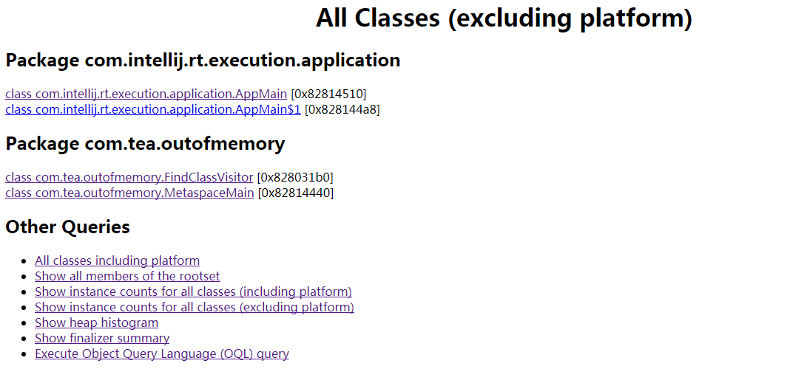

# jhat

>Analyzes the Java heap.The jhat command parses a Java heap dump file and starts a web server.

分析Java的堆。该命令能解析Java Heap Dump文件并启动一个网页服务器。

## 获得Heap Dump

[如何获得Heap Dump](../exception/OutOfMemoryError.md#如何获得heap-dump)

## 用法

~~~

Usage:  jhat [-stack <bool>] [-refs <bool>] [-port <port>] [-baseline <file>] [-debug <int>] [-version] [-h|-help] <file
>

        -J<flag>          Pass <flag> directly to the runtime system. For
                          example, -J-mx512m to use a maximum heap size of 512MB
        -stack false:     Turn off tracking object allocation call stack.
        -refs false:      Turn off tracking of references to objects
        -port <port>:     Set the port for the HTTP server.  Defaults to 7000
        -exclude <file>:  Specify a file that lists data members that should
                          be excluded from the reachableFrom query.
        -baseline <file>: Specify a baseline object dump.  Objects in
                          both heap dumps with the same ID and same class will
                          be marked as not being "new".
        -debug <int>:     Set debug level.
                            0:  No debug output
                            1:  Debug hprof file parsing
                            2:  Debug hprof file parsing, no server
        -version          Report version number
        -h|-help          Print this help and exit
        <file>            The file to read

For a dump file that contains multiple heap dumps,
you may specify which dump in the file
by appending "#<number>" to the file name, i.e. "foo.hprof#3".

All boolean options default to "true"

~~~

### 部分参数解析

* `-exclude exclude-file`

指定在对象查询中要被排除的数据成员列表。

* `-baseline exclude-file`

指定一个基准堆转储。

> Objects in both heap dumps with the same object ID are marked as not being new. Other objects are marked as new. This is useful for comparing two different heap dumps.

## 示例

## references

[1][Java Platform, Standard Edition Tools Reference | jhat](http://docs.oracle.com/javase/8/docs/technotes/tools/unix/jhat.html)

[2][Java Platform, Standard Edition Troubleshooting Guide | 2.12 The jhat Utility](http://docs.oracle.com/javase/8/docs/technotes/guides/troubleshoot/tooldescr012.html)
